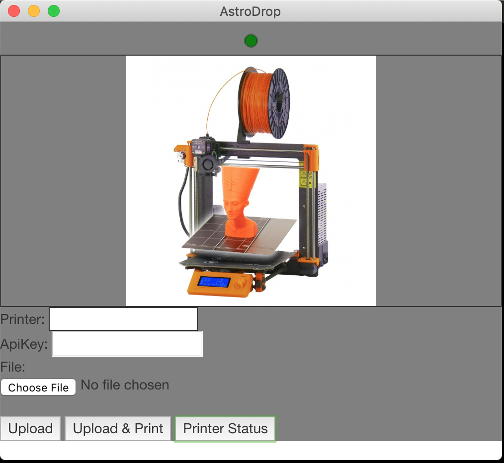

# astroDrop

An experiment as part of the `#100DaysOfCode` challenge to make an electron app to upload to my 3d printer. My printer runs [astrobox](https://www.astroprint.com/products/p/astrobox-gateway) on a raspberry pi. 

It's currently so ugly you guys. If you like making things pretty, please help. It is just so so ugly.

